# SecondhandBookTrade
### 开发环境

校园二手书籍交易管理系统  使用技术：后台 SSM 架构、前台 JSP、JavaScript 、LayUI 及相关前端框架

计算机及操作系统： PC机，Win7 系统及以上；

开发工具 : jdk1.8.0_21、StsEclipse、MySQL5.6

系统总 E-R 图如图 3-2 所示：

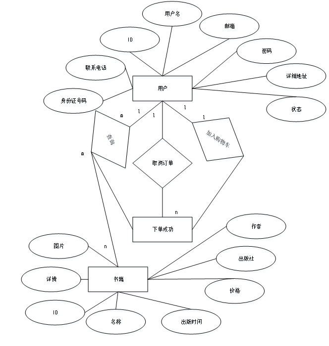


### 数据库逻辑结构设

用户信息表如表 所示，用户信息包括身份证号、用户ID等必须信息，用户ID在整个系统中的作用很大，在用户登录、进行书籍买卖交易等时都要用到该ID标识用户信息。

该表中存储了系统中所有用户的信息，包括普通用户和系统管理用户，本系统的权限设计并不是在用户刚开始注册的时候就进行分配，是专门有一个权限配置模块来进行动态配置的，所以两种不同类型的用户可以存储到一张表中，也不需要在表中建立用户类型字段来区分用户。

**用户信息表**

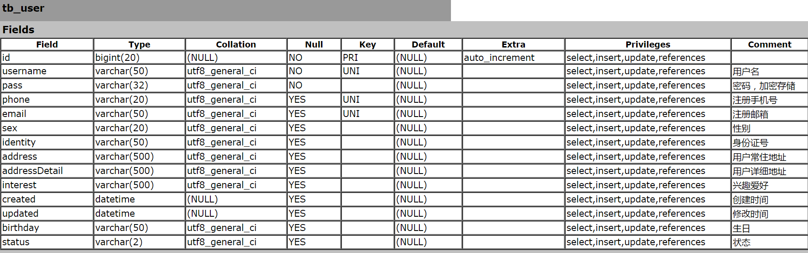

**用户角色关联信息表**

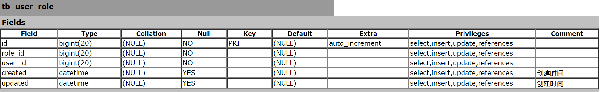 

书籍信息表，该表中建立了进行书籍买卖的必要信息，对于书籍详情的存储则另外建立了一张关联表来进行存储，可以很好的对书籍详情进行扩展，而无需调整其他书籍信息。

**书籍信息表**

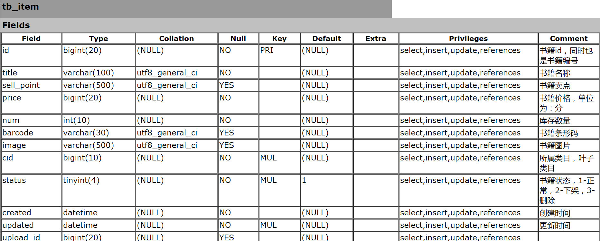

**书籍详情信息表**


权限菜单信息表本质上是一个树形目录结构，该表中存储了构建树节点的必要信息，包括ID、父节点ID、是否父节点等数据。

**权限菜单信息表**

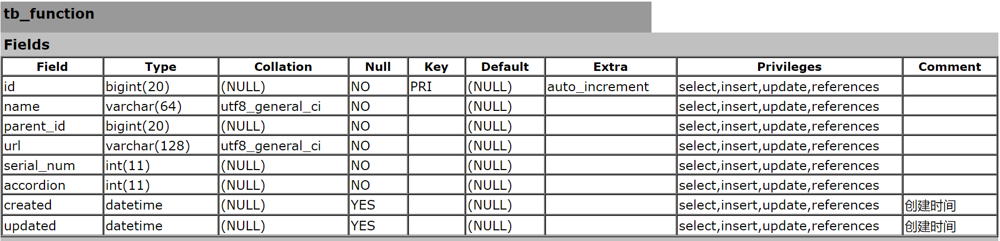

轮播图的设计是为了更好的展示系统中属于热门交易的书籍，帮助用户更好的去购买二手书，如表所示，其中除了存储了图片的URL地址，还存储了图片链接的URL地址，点击轮播图可以进行全新的展示页面。

**轮播图信息表**

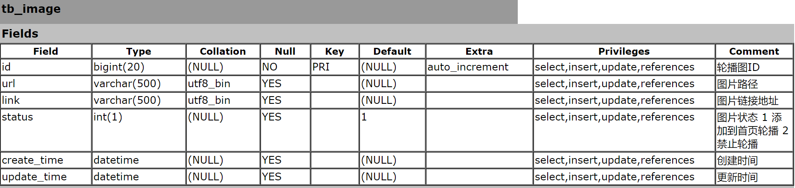

书籍类目和权限菜单类似，也是一个树形结构表，如表所示，存储了构建树的所有信息，因为本身类目划分上存在上下级别关系，正好和树形结构的特点相一致。

**书籍类目信息表**

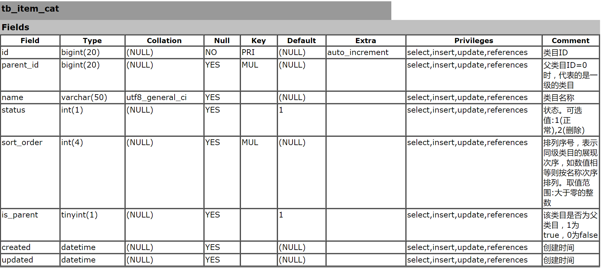

留言信息表如表所示，是用来存储用户关于某书籍的讨论信息的，所以用户ID和留言内容是必要字段，再加以留言时间和具体讨论的是那本书籍ID字段。 

**留言信息表**

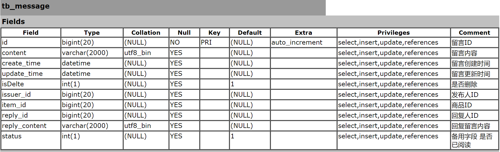

订单信息表如表所示，其中存储了用户ID、书籍ID等关联信息，以及付款方式、订单创建时间，送货地址等信息，根据此表可以得到所有的关于该订单的一切信息。

**订单信息表**

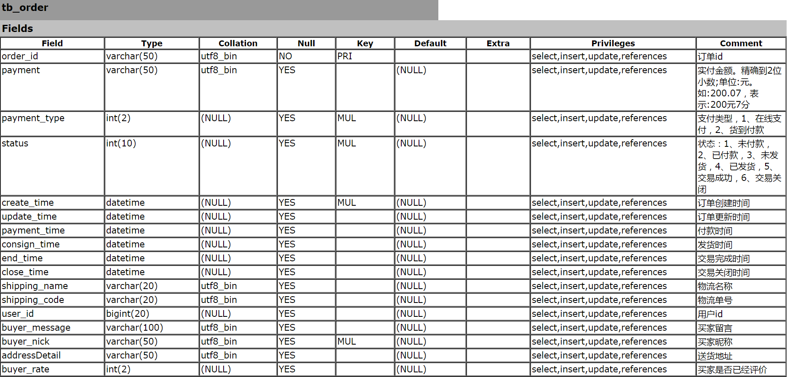

公告信息表如表所示，该表中需要存储公告标题、公告内容和发布时间以及发布人ID等信息，用来管理系统中的所有公告信息。

**公告信息表**

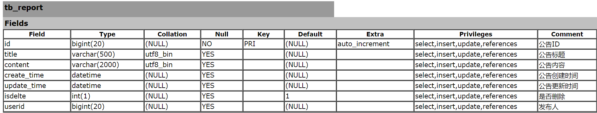

角色权限表如表所示，该表的建立是问了控制系统中角色相对应的权限，也是一张中间关联表，存储信息有角色ID，菜单ID，保证了系统中各个角色的权限分配。

**角色权限关联信息表**

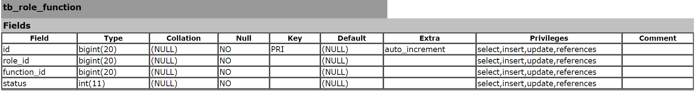

角色信息表如表所示，建立该表是为了可以大批量的为用户分配角色，而不是每个用户去分配权限，当有不同用户需要分配相同权限的时候，可以直接在系统中新建一个角色，然后赋予这些用户该角色即可。

**角色信息表**


**用户信息表**

 

### 整体功能介绍

系统的整体架构功能如图所示，该图说明了系统的基本功能关联关系，包括用户的分类，以及各类别用户具有什么权利去操作这个系统。

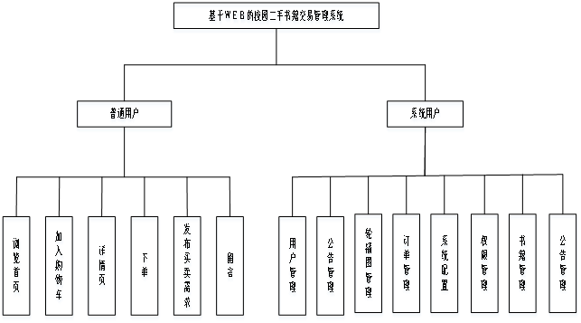

### 流程图


### 系统详细设计与编码实现

#### 权限模块

该模块主要用于对系统安全控制提供统一处理方式，统一分配权限、角色，保证系统的安全性。

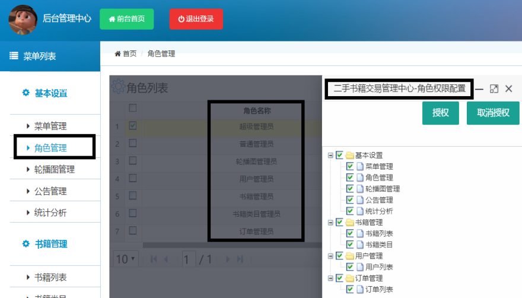

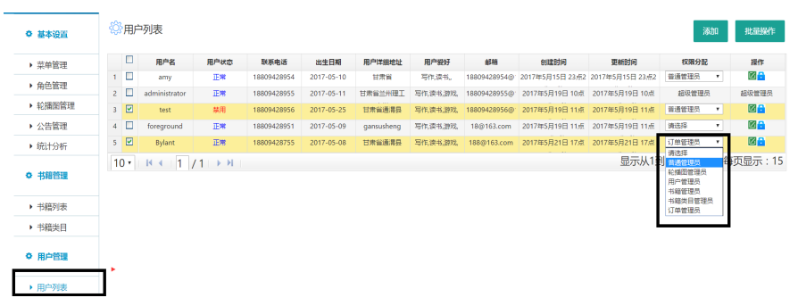

本模块负责系统的安全控制，可以说是系统的一个需要重点完成的模块，在本模块的设计过程中涉及到了用户表（tb_user）、菜单权限表（tb_function）、角色表（tb_role）、角色权

 

限关联表（tb_role_function）、用户角色关联表（tb_user_role），这五张表联合完成了系统的权限控制。菜单权限表中配置了菜单的路径，然后利用权限角色关联表来决定某一角色具有哪些菜单权限，配置给予相应的跳转路径，这样设计的一个好处就是后期更好的对菜单项来进行增删改查等操作，而不影响系统其他模块；只需要配置一个路径到菜单权限表即可；

此外，该模块为用户和角色的关联设置了关联表，可以很方便的为用户分配角色，然后根据这个用户的角色来决定他具有哪些操作权限，相当于单纯的来讲用户、角色、菜单权限来说三者降低了耦合度，便于系统做其他操作而不用考虑他们之间的改变对彼此的影响。

他的最核心地方就在于一条SQL语句：

这条SQL如下所示：

```sql
SELECT DISTINCT t.id,t.NAME,t.parent_id ,t.url

    FROM tb_function t,tb_role_function f,tb_role r,tb_user u,tb_user_role e

    WHERE 

    t.id = f.function_id AND r.id = f.role_id AND u.id = e.user_id 

    AND e.role_id = r.id AND u.id = #{userId}

ORDER BY t.id,t.parent_id

```

利用表之间的关联查询来完成系统操作权限的判断，快捷方便；并且不用在登录页面区分系统用户还是普通用户，只需要用户输入自己的用户名密码，然后发送数据到服务器，由服务器来判断该用户的权限，然后返回当前用户所具有权限操作的菜单项和功能按钮。也减少了用户负担，并且在界面美观度上使用了统一的登录界面，具有较好的友好性。

总的来讲，该模块决定了系统的所有安全性操作，是进入系统的第一道门户，从而设计的非常详细，虽然在功能上还是有所缺陷，但是具备基本的安全控制策略，鉴于此系统的主体用户是校园师生，从而在系统安全性上本身就具有一定的安全性，再加上该系统并没有实现在线支付接口，一律选择货到付款，从而也降低了一部分风险。这部分模块的设计为系统人员也提供了便利，如果是一个有HTML经验的后台管理人员，他可以自主去配置单个页面，而不用开发技术人员去单独开发部署这个页面，只需要这个管理员把菜单项路径配置到系统，然后执行相应的权限分配操作，该页面就可以在系统中予以展示，可以当做新功能的扩展。

#### 菜单管理模块

由于菜单的权限是具有树形的上下级关系的，所以在这里选择使用Z-Tree树来实现树形目录，这样的设计在系统的整体权限授权上也更为的方便，授权下级目录会自动带上他的上一级目录，便于用户去操作系统，也更加的保证了系统的安全性，树的特点决定了系统就具有这样一个特性，树是由根结点和若干颗子树构成的。树是由一个集合以及在该集合上定义的一种关系构成的。集合中的元素称为树的结点，所定义的关系称为父子关系。父子关系在树的结点之间建立了一个层次结构。在这种层次结构中有一个结点具有特殊的地位，这个结点称为该树的根结点，或称为树根。然后对树节点提供了增删改查操作，也可以进行排序，或者是上移下移，左移右移等操作，可以让系统人员很方便的配置系统菜单。

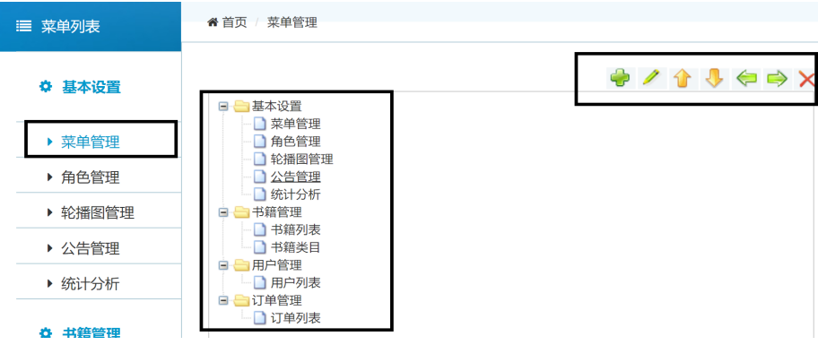

#### 系统数据列表展示模块

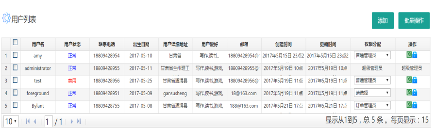

整个系统的列表展示界面为了风格统一，采用了LigerUI的Grid插件来展示，一方面节省前端页面代码的书写，另一方面在整体分页和展示界面的友好性上也比自己书写table风格要好很多，并且在所有的列表展示页面提供了多条件查询，以及添加和批量操作按钮，这些按钮也根据不同的权限做了配置，用户可以很方便的进行批量操作。此外，每个列表框都具有操作列，该列具有各种相关操作，例如在用户列表页具有用户角色配置按钮、是否禁用用户按钮等操作，而在书籍列表中，具有是否上热搜、上下架等按钮操作，相应的在轮播图列表中具有是否进行轮播按钮等。

分页，是一种将所有数据分段展示给用户的技术，用户每次看到的不是全部的数据，而是其中的一部分若果在其中没有找到自己想要的内容，可以通过制定页码或翻页的方式转换可见的内容，直到找到自己想要的内容为止。

为什么要实现分页？当然如果数据量少的话当然可以，但是对于企业信息系统来说数据量不会限制在很小的范围之内，如果不顾一切的将查询出来的数据全部返回给用户，虽然用户可以能够忍受成千上万表格式数据，但是繁忙的网络、紧张的服务器也会提出抗议。因此分页是势在必行的。

分页技术实现的SQL语句如下：

//分页查询语句

`select * from 表名 where limit page , count;`

和

//获取表中的总数据，确定页数

`select count(*) from 表名; `

使用分页技术的好处在于每次去数据库是查询很少的一部分数据，而不用去查询数据库中的所有数据，提高数据的检索速度。增加用户体验的友好性，一方面用户可能只需要看一部分数据就能解决自己的需求，如果我们一味的推送所有数据给用户，会造成数据库和服务器的压力，不利于系统的大并发量访问。

本系统在后台管理中心使用了 LigerUI 框架自带的分页技术，结合Mybatis对于分页的支持，很好的完成了分页查询的功能，在前台展示界面则自己封装了一个分页的JS类库，配合以SQL语句完成了分页，期间也使用了到了Bootstrap对分页界面的美观性做了修饰，整个界面清爽，对于用户来说应该会有比较好的体验。

#### 前台展示模块


在本模块的设计上参考了京东的首页设计，并自己使用代码实现了该系统的首页，在界面友好性上不具有很大的问题，因为是参考了京东页面的设计，广大用户对于京东的设计也是非常信赖的。

首页左上角的的书籍类目取自后台书籍类目的增删操作，正上方轮播图的操作也是从后台进行管理，决定哪些图片上轮播，后台可以指定相关的系统管理员来管理轮播图，并且每一个轮播图预留了URL链接地址，可以跳转到一个详情页提供浏览。中间大图是一个交易量很大的书籍推荐，也有管理员与之相对应进行管理，下方则是正常的书籍页面，点击之后可以进行到详情页的跳转。

详情页则会包含书籍的各种详细信息，供用户浏览。

#### 购物车模块

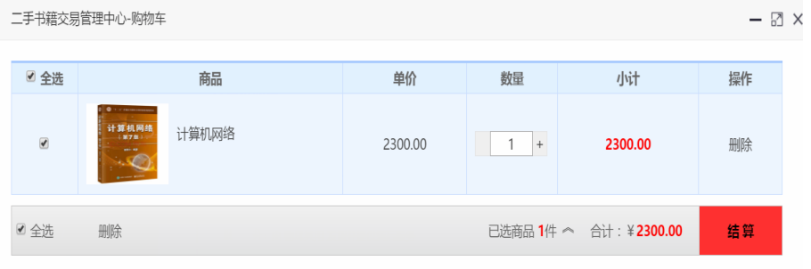

购物车设计同样是参考了网上现有电商网站的设计，设置了全选按钮，而且默认用户进入购物车是全选状态，全选按钮下一列是书籍信息，包括预览图，价格；之后可以对书籍数量进行调整，同时计算出订单总额；当购物车彻底完成之后可以进行结算，也就是下单，完成书籍二手交易。

#### 订单模块

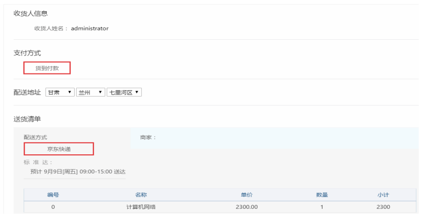

订单模块的设计直接来源于购物车结算后的跳转页，其中可以选择支付方法、快递、以

 

及送货清单，清单中包括书籍信息，以及订单总金额，还可以去选择配送地址，由于该系统目前并没有实现支付宝、财付通等支付接口，所以暂时只设置了货到付款按钮，其中的收货人信息是无法更改的，但是地址可变。

该模块在设计过程中预留了第三方支付接口，后期有需要则可以扩展，因此在设计过程中充分考虑到了这一部分的需求，鉴于现有的系统技术在完成在线交易可能存在一部分问题，所以系统暂时只是支持货到付款方式，等到后期系统进行扩展的时候在物流选择，订单状态等各个方面都可以进行友好的扩展。

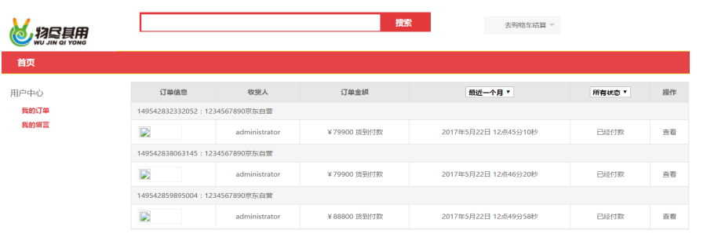

订单管理界面可以查看自己的所有订单信息，包括订单实际支付金额、订单状态、收货人等信息，这一部分和用户中心设置到了一起，目的在于方便用户操作，用户在用户中心模块可以进行一系列只和自己相关的核心操作。在设计用户中心这一模块的过程中，结合了现有网上的一些购物网站实例，最后结合本系统的实际情况，设计了这样一个相对来说比较客观的用户中心模块，便于用户的各种操作。

#### 用户注册/登录模块


用户登录模块需要用户输入用户名、密码以及验证码，如果都验证通过则予以登录成功提示信息，然后判断用户角色信息来决定用户权限，根据权限路径来赋予用户不同的操作界面，如果用户是普通用户，则直接进入首页；相反的，如果用户是系统用户，则进入后台管理中心，但是不同权限的系统人员具有的后台管理中心操作界面是不一样的，每个系统管理员只能操作自己被赋予权限的那部分菜单功能项。

验证码一般是防止有人利用机器人自动批量注册，对特定的注册用户用特定程序暴力破解方式进行不断的登录、灌水。因为验证码是一个混合了数字或符号的图片，人眼看起来很费劲，机器识别起来就更困难。输入验证码是防止大规模的灌水、回帖的发生。一般注册用户ID的地方各大论坛都要输入验证码。

##### 用户注册界面

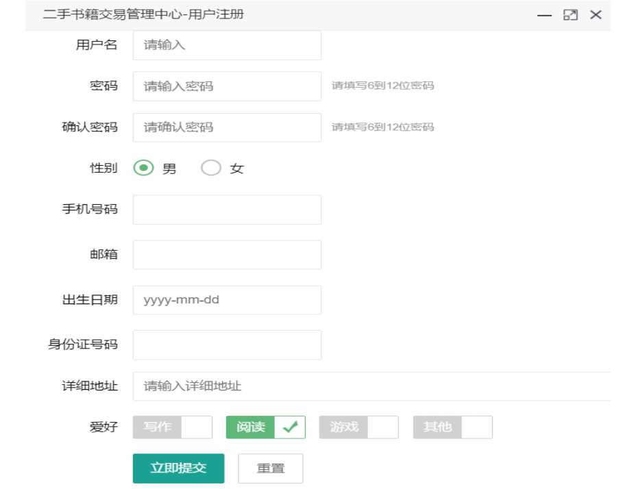

用户注册模块直接使用了LayerUI的form表单来完成，并且对每个输入框的值做了限定，包括不能为空的，如用户名、密码等选项不可为空；值有特殊格式的，如联系电话、身份证

 

号码、邮箱账号等；在出生日期的选择上使用了日期插件，可以直接预览出当前日历进行选择。

邮箱格式开始必须是一个或者多个单词字符或者是-，加上@，然后又是一个或者多个单词字符或者是-。然后是点“.”和单词字符和-的组合，可以有一个或者多个组合。所以可以得出校验邮箱的正则表达式为

`/^([a-zA-Z0-9_-])[+@([a-zA-Z0-9_-\])+(.[a-zA-Z0-9_-])+/](mailto:+@([a-zA-Z0-9_-])+(.[a-zA-Z0-9_-])+/)`

联系电话的校验格式为：

区号+座机号码+分机号码：`regexp="^(0[0-9]{2,3}\-)?([2-9][0-9]{6,7})+(\-[0-9]{1,4})?$"`

手机(中国移动手机号码)：`regexp="^((\d{3})|(\d{3}\-))?13[456789]\d{8}|15[89]\d{8}"`

所有手机号码：`regexp="^((\d{3})|(\d{3}\-))?13[0-9]\d{8}|15[89]\d{8}"`(新添加了158,159两个号段)

身份证号码的校验格式为：

身份证18位编码规则：`dddddd yyyymmdd xxx y`
`dddddd`：6位地区编码
`yyyymmdd`: 出生年(四位年)月日，如：19910215
`xxx`：顺序编码，系统产生，无法确定，奇数为男，偶数为女
`y`: 校验码，该位数值可通过前17位计算获得

​	分析可得，前17位号码加权因子为 Wi = [ 7, 9, 10, 5, 8, 4, 2, 1, 6, 3, 7, 9, 10, 5, 8, 4, 2 ]，验证位 Y = [ 1, 0, 10, 9, 8, 7, 6, 5, 4, 3, 2 ]如果验证码恰好是10，为了保证身份证是十八位，那么第十八位将用X来代替校验位计算公式：Y_P = mod( ∑(Ai×Wi),11 )，i为身份证号码1...17 位，Y_P为校验码Y所在校验码数组位置。

```javascript
function validateIdCard(idCard){

 //15位和18位身份证号码的正则表达式

 var regIdCard=/^(^[1-9]\d{7}((0\d)|(1[0-2]))(([0|1|2]\d)|3[0-1])\d{3}$)|(^[1-9]\d{5}[1-9]\d{3}((0\d)|(1[0-2]))(([0|1|2]\d)|3[0-1])((\d{4})|\d{3}[Xx])$)$/;

 //如果通过该验证，说明身份证格式正确，但准确性还需计算

 if(regIdCard.test(idCard)){

  

if(idCard.length==18){

   var idCardWi=new Array( 7, 9, 10, 5, 8, 4, 2, 1, 6, 3, 7, 9, 10, 5, 8, 4, 2 ); //将前17位加权因子保存在数组里

   var idCardY=new Array( 1, 0, 10, 9, 8, 7, 6, 5, 4, 3, 2 ); //这是除以11后，可能产生的11位余数、验证码，也保存成数组

   var idCardWiSum=0; //用来保存前17位各自乖以加权因子后的总和

   for(var i=0;i<17;i++){

    idCardWiSum+=idCard.substring(i,i+1)*idCardWi[i];

   }

   var idCardMod=idCardWiSum%11;//计算出校验码所在数组的位置

   var idCardLast=idCard.substring(17);//得到最后一位身份证号码

 

   //如果等于2，则说明校验码是10，身份证号码最后一位应该是X

   if(idCardMod==2){

    if(idCardLast=="X"||idCardLast=="x"){

     alert("恭喜通过验证啦！");

    }else{

     alert("身份证号码错误！");

    }

   }else{

    //用计算出的验证码与最后一位身份证号码匹配，如果一致，说明通过，否则是无效的身份证号码

    if(idCardLast==idCardY[idCardMod]){

     alert("恭喜通过验证啦！");

    }else{

     alert("身份证号码错误！");

    }

 }else{

  alert("身份证格式不正确!");

 }

```

### 设计总结

本系统共有七个功能模块：登录及注册功能模块、用户首页、书籍管理功能模块、系统配置功能模块、用户管理功能模块及订单管理功能模块。系统采用B/S设计模式，MVC开发模式，以StsEclipes作为前台软件开发工具，后台数据库选用MySQL数据库进行支持,采用Navicat提供数据库可视化设计、模型建立、以及管理功能,利用目前比较流行的Tomcat搭建Web 应用服务器，提供通过网页访问功能。系统操作简单，功能完善。系统按照软件工程的理论、方法和规范；遵循实用性、系统性、逐步完善、逐步发展的原则进行管理系统的开发。

起初由于对二手书籍交易系统的整个流程不够熟悉，在需求分析时没有考虑同时大量的用户对数据库同时进行操作的情况，导致系统在面临大量数据访问时会出现的瓶颈问题，这些都需要在数据库设计和数据更新时加以完善。二手书籍交易系统主要面向高校师生，要求有安全稳定的数据库设计与操作，虽然本系统的表设计还不是很完善，系统暂时的并发量并不是很大，无法满足大流量的数据操作，这也是本系统不尽人意的地方，但是这些问题将在以后的升级中逐步改进和完善。